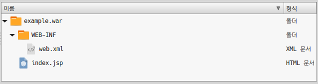
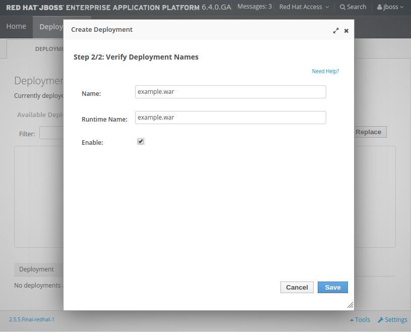

# Labs04_01 : Deplyoing Application

# 1. Example Application 생성
example.war : <BR/>
 

index.jsp : 
```
<H1> HELLO JBOSS </H1>
```

web.xml : 
```
<?xml version="1.0" encoding="UTF-8"?>
<web-app xmlns:xsi="http://www.w3.org/2001/XMLSchema-instance" xmlns="http://java.sun.com/xml/ns/javaee" xmlns:web="http://java.sun.com/xml/ns/javaee/web-app_2_5.xsd" xsi:schemaLocation="http://java.sun.com/xml/ns/javaee http://java.sun.com/xml/ns/javaee/web-app_3_0.xsd" id="WebApp_ID" version="3.0">

  <display-name>example</display-name> 
  
  <welcome-file-list>
    <welcome-file>index.jsp</welcome-file>
  </welcome-file-list>

</web-app>
```


# 2. Example Application 압축
```
cd example.war
jar -cvf example.war *
```

# 3. Deploy Application
jboss 관리자 콘솔 접속 > Deployments > Add > example.war <BR/>
 
