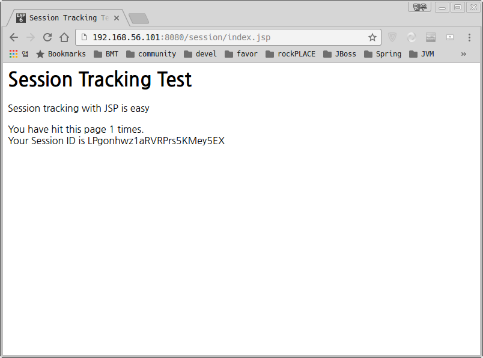

# Labs04_02 : Deploying Application Manually

# 1. sesion.war 다운로드
```
]$ mkdir /jboss/applications
]$ wget https://github.com/nationminu/EAP_TRANING/archive/master.zip
]$ unzip master.zip
```

# 2. "demo/session" 디렉토리를 "/jboss/applications/session.war" 복사
```
]$ cp -r EAP_TRANING-master/demo/session/ /jboss/applications/session.war/
```

# 3. standalone.xml Deployment 설정 추가
```
    <deployments> 
        <deployment name="session.war" runtime-name="session.war">
            <fs-exploded path="/jboss/applications/session.war"/>
        </deployment>
    </deployments>
```

# 4. Application 확인
http://192.167.56.101:8080/session/index.jsp 접속 <BR/>
 


