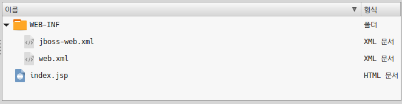

# Labs04_03 : Setting the Root Web Location

# 1. example.war/WEB-INF/jboss-web.xml
 
```
<jboss-web>
  <context-root>/</context-root>
</jboss-web>
```

# 2. standalone.xml "enable-welcome-root" 설정 변경
CLI 설정 :
```
/] /subsystem=web/virtual-server=default-host:write-attribute(name=enable-welcome-root,value=false)
```
XML 변경 : 
```
<virtual-server name="default-host" enable-welcome-root="false">
  <alias name="localhost"/>
  <alias name="example.com"/>
</virtual-server>
```
JBOSS 재기동:
```
]$ ./shutdown.sh
]$ ./start.sh
```

# 3. GUI 콘솔로 example.war 재배포(replace)
 

# 4. 웹 애플리케이션 root web 변경 확인
http://192.168.56.101:8080/
