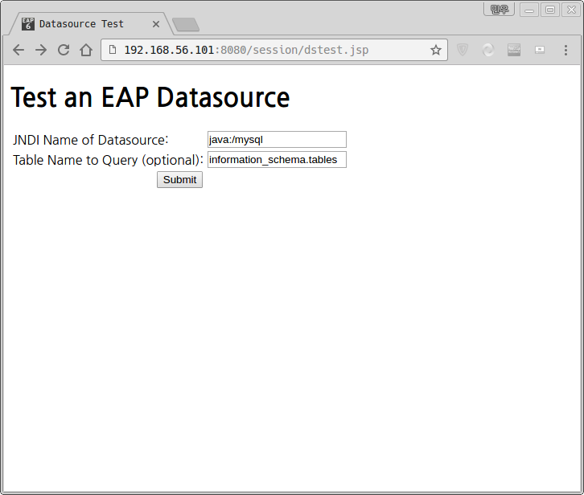

# Labs05_02 : Application DataSource Lookup

# 1. session.war 배포 확인
```
]$ ./jboss-cli.sh
/] deployment-info 
NAME        RUNTIME-NAME PERSISTENT ENABLED STATUS 
example.war example.war  true       true    OK     
session.war session.war  true       true    OK   
```

# 2. 브라우저를 통해 session.war 접속
http://192.168.56.101:8080/session/dstest.jsp <BR/>

# 3. 필수 정보 입력
JNDI Name of Datasource: java:/mysql <BR/>
Table Name to Query (optional): information_schema.tables <BR/>


# 4. MySQL SCHEMA 생성
```
]$ mysql -uroot -p labs -e "create table labs_ex(no int(11) not null primary key auto_increment,id varchar(100))"
]$ mysql -uroot -p labs -e "insert into labs_ex(id) values(concat('hello labs : ',now()))"
```

# 5. 필수 정보 입력
JNDI Name of Datasource: java:/mysql <BR/>
Table Name to Query (optional): labs_ex <BR/>

